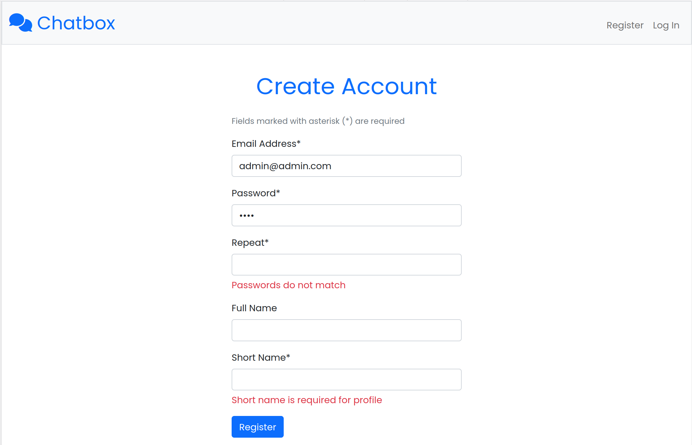
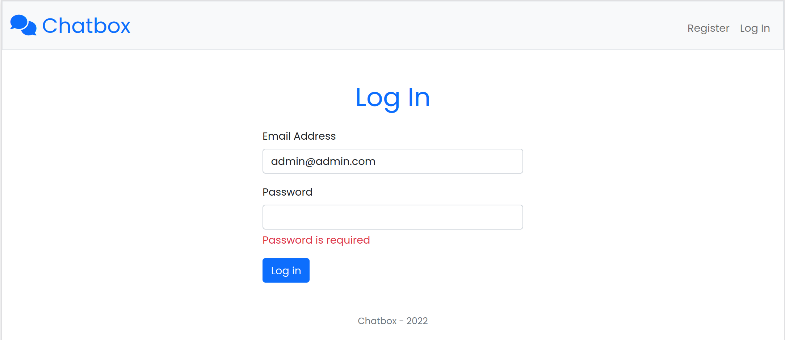
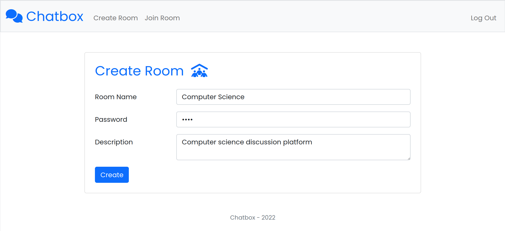
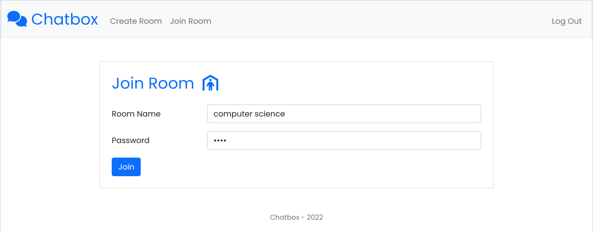
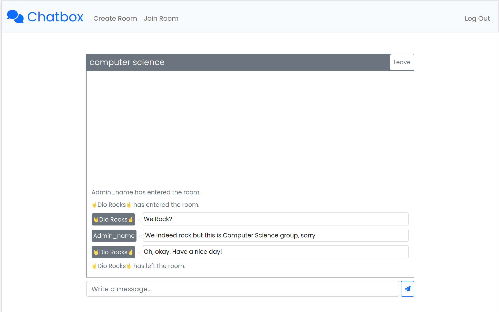

# Flask Group Chat

In messaging applications, sent messages pass through servers that we cannot control. If these servers are not open-sourced, one cannot be sure of their information's privacy. This application addresses aforementioned issue by providing open-source server application that people can host on their machine to communicate with their loved ones. They can choose between hosting to public internet or only to their local network.

Users should create an account to enter the application. Messaging happens in chat rooms. Each user can create unlimited number of rooms or they can join previously created ones. Messages are broadcasted to the room's participants. 

User accounts and chat rooms are protected by passwords. These passwords are hashed before storing in databases.

## Requirements

* Python 3
* Pip 3

## Running Server Locally

* Install Python dependencies
```sh
pip3 install -r requirements.txt
```
* Initiate the Sqlite3 database with flask CLI command
```sh
flask init-db
```
* [OPTIONAL] Insert mock data to database for test purposes. All mock passwords are `1234`.
```sh
flask import-mock-data
```
* Start the Flask server
```sh
python app.py
```
* Access the application from browser
```sh
http://localhost:5000
```

## Application Interface

* Create account



* Login



* Create chat room



* Join chat room



* Live chat page



## Technologies

* [Python Flask](https://flask.palletsprojects.com/en/2.1.x/quickstart/) back-end
* [Jinja2](https://jinja.palletsprojects.com/en/3.1.x/templates/) template engine for Flask
* HTML, CSS, JS front-end
* [Bootstrap 5.1](https://getbootstrap.com/docs/5.1/getting-started/introduction/) CSS framework
* [Socket.io](https://socket.io/docs/v4/client-api/) JS client API and [flask-socketio](https://flask-socketio.readthedocs.io/en/latest/getting_started.html) library
* [Sqlite3](https://www.sqlite.org/about.html) database
